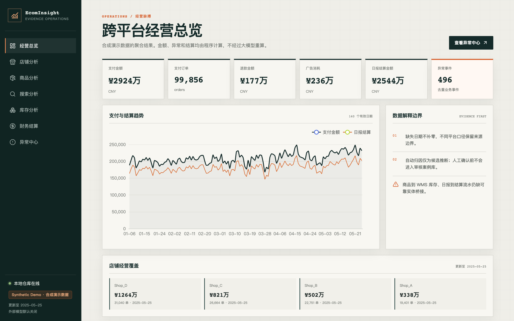
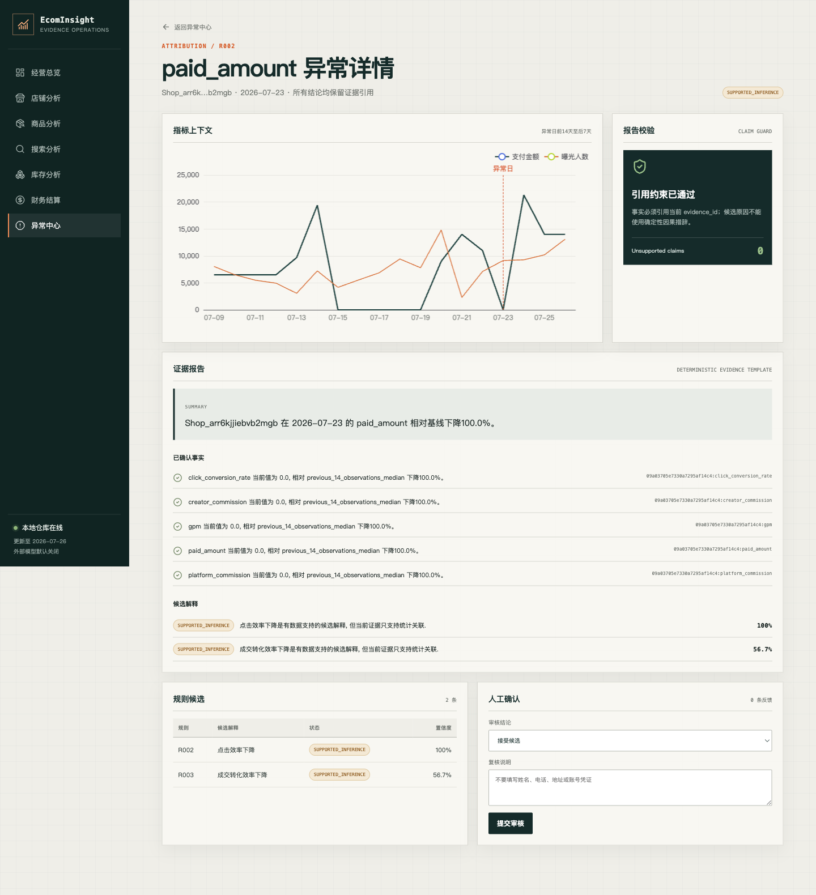

# EcomInsight

Multi-platform E-commerce Analytics, Anomaly Detection and Evidence-based Attribution System.

EcomInsight is a portfolio-grade analytics project built from real multi-source e-commerce
operations data. The system treats the language model as a report writer over verified evidence,
not as a calculator or a source of causal claims.

## Current status

- Phase 0 complete: read-only data audit, data dictionary and architecture.
- Phase 1 complete: Python 3.12/uv project, configuration, logging and quality tooling.
- Phase 2 complete: privacy-first adapters, Parquet staging and DuckDB warehouse.
- Phase 3 complete: validated metric registry and shop, product, channel, search, inventory and
  financial marts.
- Phase 4 baseline complete: fixed threshold, Rolling Z-score, Rolling MAD and Isolation Forest,
  with real-warehouse alerts and controlled-label evaluation.
- Phase 5 complete: log-change metric decomposition, ten deterministic evidence rules,
  real-warehouse attribution tables and controlled-scenario evaluation.
- Phase 6 complete: local knowledge embeddings, parameterized SQL evidence tools,
  evidence-constrained JSON reports and retrieval/report evaluation.
- Phase 7 complete: FastAPI query service, separate human-feedback store, React/TypeScript
  operations console, responsive anomaly detail workflow and Docker Compose deployment.
- A fully synthetic, cross-domain 140-day demo dataset provides ten controlled anomaly scenarios
  for later detection and attribution evaluation.

## Product preview



The anomaly detail page keeps metric context, confirmed facts, candidate inferences, source IDs and
human review in one auditable workflow:



## Verified local data

- 165 shop-day operation rows: 105 Douyin and 60 external-platform rows.
- 23 channel shop-days, 186 product-days and 362 search/source rows.
- 11 independent inventory snapshots.
- 612 authoritative order rows containing direct personal information.
- 6198 settlement business lines after excluding four file-summary rows.

These counts come from the Phase 0 read-only audit and are not synthetic performance claims.

## Architecture

```text
read-only sources
→ allowlist/denylist discovery
→ streaming privacy sanitizer
→ unit-aware Parquet staging
→ data contracts
→ DuckDB curated facts and dimensions
→ metrics
→ anomaly detection
→ evidence rules
→ constrained LLM report
```

See:

- [Data audit](docs/data_audit.md)
- [Data dictionary](docs/data_dictionary.md)
- [Architecture](docs/architecture.md)
- [Warehouse implementation](docs/warehouse.md)
- [Privacy and security](docs/privacy_and_security.md)
- [Metric definitions](docs/metric_definitions.md)
- [Phase 3 analysis](docs/phase3_analysis.md)
- [Phase 4 experiments](docs/experiments.md)
- [Phase 5 attribution experiments](docs/attribution_experiments.md)
- [Phase 6 retrieval and reporting experiments](docs/retrieval_reporting_experiments.md)
- [Synthetic data design](docs/synthetic_data.md)

## Privacy defaults

- Browser sessions, auth tables, config, logs and login screenshots are hard-excluded.
- Names, phones and addresses are removed before an order record can enter a DataFrame.
- Order, shop, product, SKU, creator, merchant and warehouse identifiers are stable HMAC aliases.
- The local HMAC salt is stored with mode `0600` outside version control.
- Real database, CSV, JSON, Parquet and DuckDB files are ignored.
- External APIs are disabled by default.

## Local setup

```bash
uv sync --all-groups
cp .env.example .env
```

Set `ECOM_SOURCE_ROOT` to the snapshot's `current` directory, then:

```bash
uv run ecom-audit-data
uv run ecom-build-warehouse
uv run ecom-run-analysis
uv run ecom-run-anomaly
uv run ecom-evaluate-anomaly
uv run ecom-run-attribution
uv run ecom-evaluate-attribution
uv run ecom-build-knowledge
uv run ecom-generate-reports
uv run ecom-evaluate-reporting
uv run ecom-generate-demo-data
uv run pytest
```

The builder never modifies the source snapshot. Generated outputs are written under
`data/processed` and ignored by Git.

## Run the application

Build the warehouse and Phase 3–6 results once, then start two terminals:

```bash
# Terminal 1
uv run ecom-api

# Terminal 2
npm --prefix frontend ci
npm --prefix frontend run dev
```

Open `http://127.0.0.1:5173`. FastAPI OpenAPI documentation is available at
`http://127.0.0.1:8000/docs`. The frontend proxies `/api` locally, and neither service sends
company data to an external model.

For a containerized preview, keep `data/processed/ecom_insight.duckdb` on the host and run:

```bash
docker compose up --build
```

The analytics warehouse is mounted read-only. Human review is written to a separate Docker volume.
See [Phase 7 application and deployment](docs/phase7_application.md).

## Verified Phase 2 build

The warehouse was rebuilt twice against the audited snapshot with identical core row counts:

| Curated object | Rows |
|---|---:|
| `fact_shop_daily` | 165 |
| `fact_product_daily` | 186 |
| `fact_order_sanitized` | 612 |
| `fact_settlement` | 6198 |
| `fact_inventory_snapshot` | 12693 across 11 snapshots |
| `bridge_product_sku` | 7 candidate links |

The final quality report contains no failed checks. Its warning records 239 negative available
inventory observations across all historical snapshots; the latest snapshot contains the 28
already documented in Phase 0. Negative availability is retained rather than silently changed.

Curated money columns are `DECIMAL(18,2)` yuan. No raw receiver, phone, address, order-number,
credential or authentication columns exist in the generated warehouse.

## Synthetic evaluation data

The source snapshot is never padded with invented records. Insufficient history and unavailable
cross-domain links are handled through a separate `synthetic=true` dataset under
`data/demo/generated`. It reconciles shop, product, channel, search, inventory and financial
facts and carries controlled ground-truth labels.

The current demo contains 12,450 records and ten verified scenarios: traffic decline, click-rate
decline, conversion decline, average-order-value decline, refund spike, overstock, inefficient ad
spend, core-SKU stockout, commission spike and settlement decline. Synthetic and real evaluation
results must be reported separately.

## Known limitations

- Per-shop history is uneven: the four Douyin shops have 11, 39, 43 and 12 observations.
- Channel, product and search data cover only seven captured dates.
- Product IDs do not directly link platform product facts to WMS or settlement products.
- Current order and settlement extracts have no overlapping order identifiers.
- Activity calendars, price changes and ad-plan changes are not currently available, so
  correlations cannot be described as confirmed causes.
