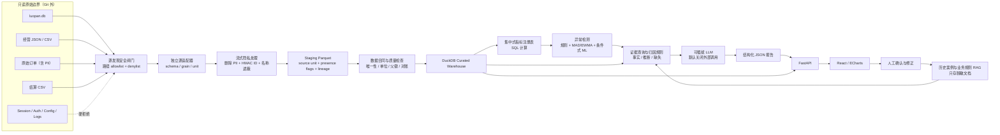
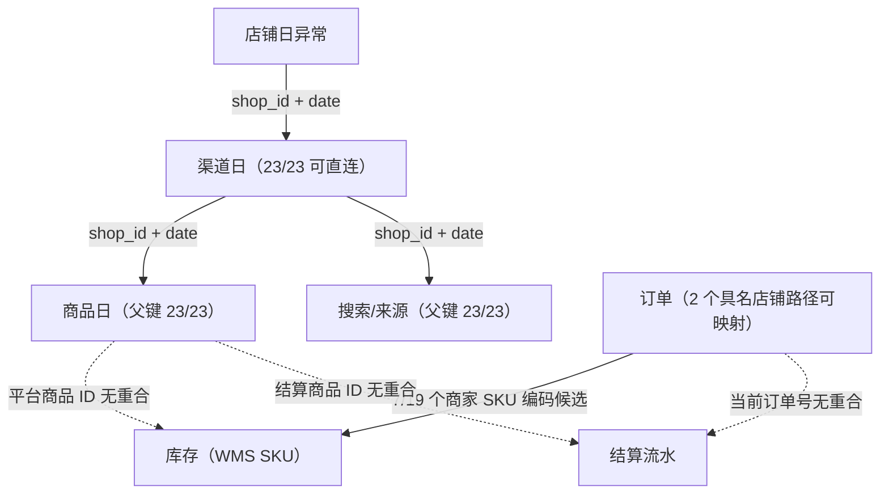

# EcomInsight 架构设计（基于 Phase 0 审计）

## 1. 设计目标

系统将“事实计算”和“语言表达”分离：

```text
结构化程序负责：读取、脱敏、单位转换、指标计算、异常检测、证据关联、置信度
大模型负责：在给定证据和约束下组织结构化报告
```

大模型不得接触原始订单、客户身份、认证数据和未脱敏商业实体，也不得直接计算核心指标。

## 2. 总体数据流



## 3. 安全边界

### Zone 0：原始只读区

- 路径通过环境变量或本机配置注入；
- SQLite 用 URI `mode=ro`；
- 启动时验证源文件 inode/mtime，仅用于检测意外修改；
- 禁止递归扫描用户目录；
- 只允许明确的数据路径模式；
- `session/config/logs`、认证表和登录图像在发现阶段硬拒绝。

### Zone 1：隐私闸门

订单适配器不能先返回原始 DataFrame。处理顺序必须是：

```text
逐行读取
→ 立即删除姓名、电话、地址
→ 订单/子订单 ID 使用 HMAC-SHA256
→ 商品、SKU、作者和店铺按策略遮蔽
→ 敏感正则扫描
→ 通过后才产生 Pydantic/Arrow 记录
```

HMAC 盐只从环境变量或本机密钥存储读取，不写入配置样例、日志或 Git。公开演示数据从合成生成器产生，不从“脱敏后的真实订单”直接导出。

### Zone 2：分析区

staging 层保存：

```text
raw_field_name
normalized_field_name
raw_value_sanitized
source_unit
normalized_unit
field_present
source_system
source_record_id
captured_at
loaded_at
quality_flags
```

curated 层只包含脱敏事实和维度。LLM/RAG 仅能访问 curated 聚合、异常结果、规则结果和脱敏案例。

## 4. 源适配器

```text
BaseSourceAdapter
├── LuopanSQLiteAdapter
├── DailyCaptureReconciliationAdapter
├── ChannelSQLiteAdapter
├── InventoryJsonAdapter
├── SanitizedOrderCsvAdapter
├── ExternalOrdersJsonAdapter
└── SettlementCsvAdapter
```

每个适配器负责：

- 路径 allowlist；
- schema 版本识别；
- 原始字段到 staging 字段映射；
- 日期、金额、比例和枚举解析；
- 源粒度和候选主键；
- 结构性空值与真实缺失区分；
- lineage；
- 不打印行值的错误日志。

适配器不计算业务指标。业务指标由指标注册表和 SQL 层统一完成。

## 5. 仓库模型

### 5.1 事实表

| 表 | 粒度 | 关键来源 | 说明 |
|---|---|---|---|
| `fact_shop_daily` | 店铺 × 日 × source scope | `operation_records` | 抖音与外部平台同表但保留来源和口径 |
| `fact_product_daily` | 店铺 × 日 × 源商品 | `channel_product_daily` | 仅 7 个采集日 |
| `fact_channel_daily` | 店铺 × 日 × 渠道 | `traffic_json.sources` | 长表 |
| `fact_content_carrier_daily` | 店铺 × 日 × 载体 | `traffic_json.carriers` | 字段按载体可选 |
| `fact_search_term_daily` | 店铺 × 日 × kind × 词 | 搜索词 payload | `industry_term` / `shop_term` 分模型 |
| `fact_traffic_source_daily` | 店铺 × 日 × 来源 | `kind=source` | 不与搜索词混表 |
| `fact_inventory_snapshot` | 日 × 仓库 × SKU | 库存快照 | 负可用库存保留 |
| `fact_inventory_flow_daily` | 日 × 仓库 × SKU × 流类型 | 7 日销量/30 日入库 | sale/inbound |
| `fact_order_sanitized` | 匿名订单商品行 | 权威订单 CSV | 不含客户 PII |
| `fact_settlement` | 结算流水行 | 4 个结算 CSV | 排除文件汇总行 |
| `fact_external_shop_daily` | 外部店铺 × 日 | 外部订单汇总 | 可作为 shop_daily 的源视图或独立事实 |
| `fact_anomaly` | 实体 × 日 × 指标 × detector | 检测器 | 版本化 |
| `fact_attribution_evidence` | anomaly × evidence | 规则引擎 | 记录事实等级和来源 |

### 5.2 维度和桥接

核心维度：

```text
dim_date
dim_platform
dim_shop
dim_product
dim_sku
dim_channel
dim_content_type
dim_warehouse
```

同一真实实体在不同来源中先作为不同 source entity 存在。关联通过桥接表表达：

```text
bridge_entity_link(
  left_source,
  left_entity_id,
  right_source,
  right_entity_id,
  link_method,
  link_status,
  confidence,
  evidence,
  valid_from,
  valid_to
)
```

只有 `direct_id`、经确认的 `standard_code` 或 `manual_confirmed` 才能用于正式事实连接。名称精确/模糊匹配只生成候选。

## 6. 当前可用的证据路径



因此第一版归因可以可靠支持：

- 店铺 → 渠道 → 商品/搜索；
- 库存内部的 SKU、销量和入库证据；
- 结算内部的订单聚合和费用证据。

“店铺下降 → 主销平台商品 → WMS 主销 SKU 缺货”和“店铺日报 → 结算流水”只能在桥接映射确认后升级为 supported inference。

## 7. 指标层

指标定义集中在 `configs/metrics.yaml` 和 Python 注册模型中：

```text
metric_code
display_name
business_definition
formula_sql
source_tables
grain
unit
applicable_platforms
null_policy
minimum_history
quality_requirements
notes
version
```

所有派生指标通过 DuckDB SQL 计算并保存计算版本。禁止在 API、前端或 LLM prompt 中复制公式。

金额策略：

- staging 保留源值和源单位；
- curated 统一为元的 `DECIMAL(18,2)`；
- 不使用二进制浮点计算金额；
- 每次从分转元都有可测试的转换函数；
- 多口径退款和结算分别命名，不覆盖。

## 8. 异常检测门控

检测器注册信息包含 `minimum_observations`、`requires_regular_series` 和 `supports_missing_dates`。

| 方法 | 当前启用条件 | 当前结论 |
|---|---|---|
| 固定阈值/业务规则 | 有业务定义即可 | 可用 |
| 日环比 | 相邻有效日；缺日标记 | 可用 |
| 7/14 日滚动偏离 | 达到最小历史且不把缺失补 0 | 两家长序列优先 |
| MAD / Robust Z-score | 至少 14 个有效观察，MAD 非 0 | 两家店优先 |
| EWMA | 至少 14 个有效观察 | 两家店优先 |
| STL | 规则时间序列且至少多个季节周期 | 当前默认关闭 |
| Isolation Forest | pooled baseline，特征完整且单独评测 | Phase 4 候选 |
| LOF / One-Class SVM | 足够样本并完成缩放/敏感度分析 | 当前不优先 |
| 深度学习 | 长历史和可靠标签 | 当前不使用 |

商品、搜索和渠道的 7 日数据优先做横截面贡献、同行基准越界和规则告警，不伪装成成熟时序模型。

## 9. 归因引擎

### 9.1 变化分解

主分解使用对数变化，避免简单百分比相加误差：

```text
paid_amount ≈ exposure_users
              × exposure_click_rate_users
              × click_conversion_rate_users
              × avg_order_value

Δlog(paid_amount) ≈
  Δlog(exposure_users)
  + Δlog(exposure_click_rate_users)
  + Δlog(click_conversion_rate_users)
  + Δlog(avg_order_value)
  + residual
```

零值时切换到带平滑项的贡献法，并在结果中记录方法与残差，不能隐藏不可分解情况。

### 9.2 证据等级

```text
confirmed_fact
  来自通过质量检查的 SQL 结果，可复算

supported_inference
  规则前置条件满足，存在支持和反向证据，不能写成因果

unverified_hypothesis
  业务上合理，但缺少可验证数据

insufficient_data
  关键字段/日期/关联缺失
```

每条证据保存：

```text
source_table
source_keys_masked
metric_code
current_value
baseline_value
unit
comparison_window
quality_flags
rule_id
rule_version
confidence
```

### 9.3 置信度

第一版使用透明评分，不训练黑盒因果模型：

```text
confidence =
  evidence_completeness
  × source_reliability
  × directional_consistency
  × temporal_alignment
  × (1 - contradiction_penalty)
```

每个分量 0～1 并写入结果。缺少可关联库存或结算数据时，不允许通过语言模型补足。

## 10. RAG 与 LLM

结构化数值只通过 SQL 和工具查询，不进入向量库。向量检索仅保存：

- 指标定义；
- 数据口径；
- 脱敏历史异常案例；
- 业务规则；
- 人工确认的归因；
- 复盘文档；
- 已生成的脱敏报告。

LLM 接口：

```text
EvidenceReportGenerator Protocol
├── DisabledGenerator（默认）
├── LocalOpenAICompatibleGenerator
└── ExternalOpenAICompatibleGenerator（显式启用）
```

输入为 Pydantic 校验后的 `EvidenceBundle`，输出为受限 JSON schema。输出中的每个事实必须引用 evidence ID；没有引用的陈述自动降级或拒绝。

## 11. 可重复构建

建议命令：

```text
make audit
make warehouse
make quality
make analyze
make test
```

构建要求：

- 输入只读；
- 输出写入独立 `data/processed`；
- 每次构建生成 manifest：源文件匿名 ID、大小、mtime、schema、行数、代码版本；
- 同一输入与代码版本产生同一主键集合和指标结果；
- 失败时保留匿名错误摘要，不保留原始行；
- DuckDB 文件、Parquet、原始 JSON/CSV 和真实映射全部 Git ignore。

## 12. Phase 1/2 实施边界

Phase 1 只建立项目工程骨架、配置、日志、测试和文档入口。

Phase 2 先完成：

1. 安全发现器和隐私 sanitizer；
2. SQLite/库存/订单/结算适配器；
3. staging schema 与单位转换；
4. DuckDB 事实、维度和桥接表；
5. 数据合同与幂等测试。

异常检测、归因、RAG、API 和前端不在 Phase 2 混入，避免在基础数据口径未稳定时形成不可验证的展示层。
