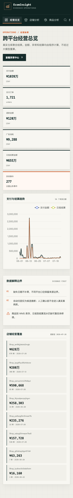

# Phase 7 应用、反馈与部署

## 交付结论

Phase 7 已把本地 DuckDB 分析结果交付为可运行应用，而不是静态截图：

- FastAPI 提供 12 个经营查询与反馈路由；
- React + TypeScript + ECharts 提供 8 个分析页面；
- 异常详情同时展示趋势、事实、候选推断、证据 ID、校验状态和人工反馈；
- 分析 DuckDB 始终只读，人工反馈写入独立 SQLite；
- Docker Compose 将分析库只读挂载，并用独立 volume 保存反馈；
- 前端生产构建、TypeScript 检查、Python 测试和浏览器联调均已实际执行。

## 运行架构

```text
Browser
  └─ /api proxy
       ├─ React operations console
       └─ FastAPI
            ├─ read-only parameterized queries → ecom_insight.duckdb
            └─ reviewed feedback             → feedback.sqlite
```

FastAPI 不接受任意 SQL。页面使用固定仓库方法读取：

- 全局经营总览与店铺日趋势；
- 商品、搜索、库存与财务聚合；
- 异常列表、规则候选、证据和报告；
- 人工接受、拒绝或修正归因。

反馈内容经过 Pydantic 校验。手机号、身份证号、Authorization、Cookie、Token 和明显凭证
模式会被拒绝；修正原因时必须填写新的原因说明。真实分析仓库不因反馈操作而被修改。

## 页面

| 页面 | 主要内容 |
|---|---|
| 经营总览 | 支付、订单、退款、投放、结算、异常数与店铺覆盖 |
| 店铺分析 | 店铺选择、销售趋势、漏斗指标、退款与投放 |
| 商品分析 | 商品支付排行、曝光、点击与转化 |
| 搜索分析 | 搜索词曝光、支付、排名和基准 |
| 库存分析 | 最新库存状态、可用量、库龄与风险标记 |
| 财务结算 | 用户实付、收入、补贴、佣金、退款和净收入 |
| 异常中心 | 指标、严重度、算法、基线、变化率和归因状态 |
| 异常详情 | 相关趋势、事实证据、候选解释、报告校验和人工复核 |

### 桌面总览


### 异常详情


### 移动端



浏览器验收覆盖 1440px 桌面视口和 390px 移动视口。页面控制台无运行错误，所有页面读取
真实本地仓库的脱敏聚合结果。

## 本地运行

首次运行前先完成数据流水线：

```bash
uv sync --all-groups
uv run ecom-build-warehouse
uv run ecom-run-analysis
uv run ecom-run-anomaly
uv run ecom-run-attribution
uv run ecom-build-knowledge
uv run ecom-generate-reports
```

再分别启动：

```bash
uv run ecom-api
npm --prefix frontend ci
npm --prefix frontend run dev
```

访问：

- 控制台：`http://127.0.0.1:5173`
- OpenAPI：`http://127.0.0.1:8000/docs`
- 健康检查：`http://127.0.0.1:8000/api/health`

## Docker Compose

```bash
docker compose up --build
```

容器只读取宿主机已有的 `data/processed/ecom_insight.duckdb`。原始快照不会进入构建上下文，
分析库以只读 volume 挂载，反馈 SQLite 保存在 `feedback_data` volume。停止服务：

```bash
docker compose down
```

## 当前验收结果

| 检查 | 结果 |
|---|---|
| TypeScript | `tsc --noEmit` 通过 |
| 前端生产构建 | Vite 构建通过，依赖拆为 React、Query、Charts 与业务代码 |
| npm audit | 0 vulnerabilities |
| API 单元测试 | 健康检查、查询、反馈校验通过 |
| 浏览器联调 | 总览、异常中心、异常详情与响应式布局通过 |
| Docker Compose | `docker compose config` 通过 |
| 报告一致性 | 277 份报告，1,896 条声明，0 条 unsupported claim |

## 限制

- 页面显示的是当前本地分析仓库，不直接读取原始快照；
- 反馈晋升为检索案例的定时任务尚未实现，当前只落入独立审核库；
- 当前没有登录和多用户权限，部署在公网前必须增加认证、授权和审计；
- Docker 文件已通过 Compose 配置与路径检查；本机实际构建因 Docker Hub/GHCR 基础镜像
  元数据拉取持续无进度而中止，尚不能记录为镜像构建通过；
- UI 不改变数据关联边界：商品—WMS 和日报—结算缺少可靠桥接时仍显示数据不足。
